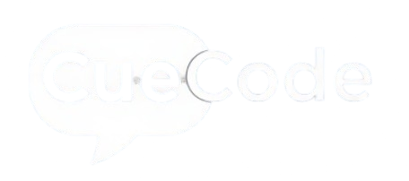
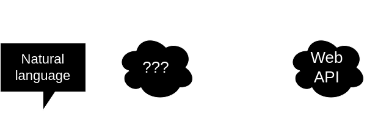
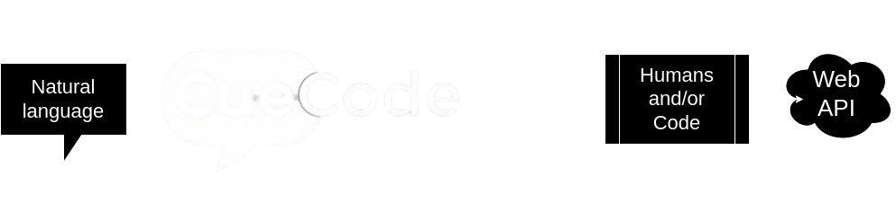

---

- :material-account-group: __[The Team](./team.md)__  
- :material-presentation-play: __[Presentations](./presentation.md)__
- :material-book: __[References](./references.md)__
- :material-tag: __[Glossary](./glossary.md)__

Please see our [Presentations](presentation.md) section for an overview of the problem, solution,
and major functional componenets of the CueCode system.

The presentation will explain further the simple problem/solution statement below.
  
---
  
## Problem

End-users need to enter data and trigger actions in systems via Web APIs, using
only natural lanaguage. But:

* There's not an abstracted framework for developers
to create those features using existing Large Language Model (LLM) technology.
* Existing approaches leave too much up to the LLM, dramatically increasing risk.
This prevents many organizations and software systems from adopting LLM technology.

---
  
## Solution

CueCode makes it easy to turn natural language into Web API calls.
Developers may leverage this capability in a number of ways, many of which
reduce the business risk of other available options for using LLMs to
generate Web API calls.

> :bulb: Please see the presentation slide decks for more information.
Thank you for your time!

---