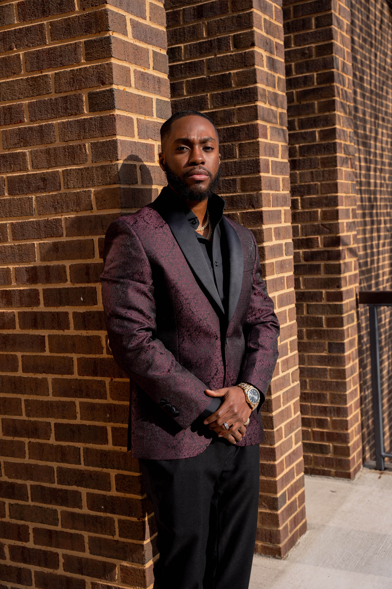
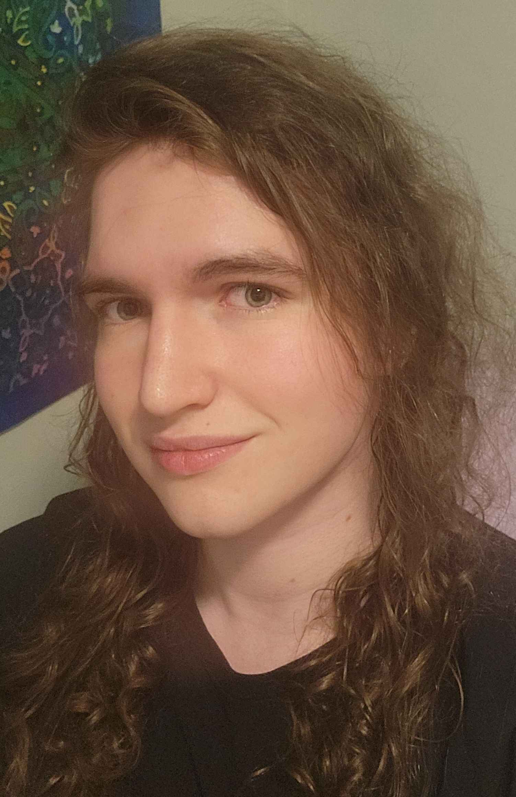
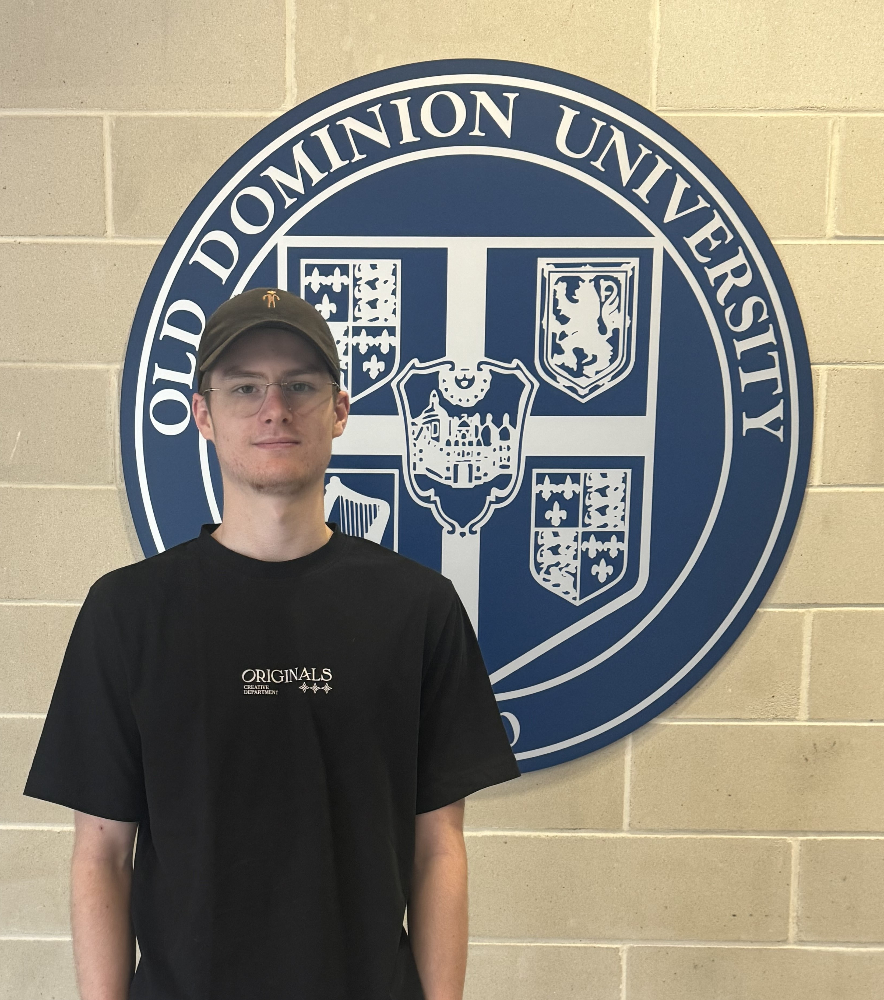
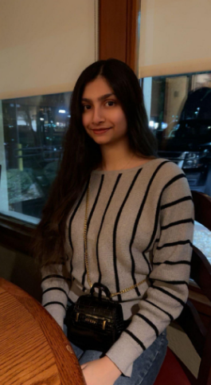

- { width="100" height="100" align=right style="border-radius: 10%;" }
  __John Hicks__ - _Team lead/Backend specialist_ 

  John Hicks is a part-time Computer Science major at ODU, a transfer student from Tidewater Community College (TCC) where he earned his Associate of Science with a specialization in Computer Science. John has been employed full-time in software development and IT roles during most of his time in school. John began his journey into software development when his parents' small business needed a website upgrade from Microsoft Front Page to WordPress. On understanding WordPress’s hook and filter mechanisms, John’s imagination was kindled in wondering what other ways of writing software there might be. That curiosity turned to flame and was formed into skill with the help of many friends, family, Internet contributors, workplace mentors, and school faculty.
- { width="100" height="100" align=right style="border-radius: 10%;" }
  __Freddie Boateng__ - _Documentation Specialist/Webmaster_  

  Fred Boateng is Computer Science major with a minor in Cybersecurity. He is from Northern Virginia and currently working as a Cybersecurity Engineer with Zachary Piper Solutions. He strives to always improve and stay updated  to the world of technology, enabling him to reach his goals.
- { width="100" height="100" align=right style="border-radius: 10%;" }
  __Chase Wallace__ - _Backend Specialist_   

  Chase Wallace is a Computer Science and Biomedical Sciences double major from Norfolk with a strong interest in neuroscience and artificial intelligence. He is always ready to learn new skills and broaden his horizons with challenging new projects.
- { width="100" height="100" align=right style="border-radius: 10%;" }
  __Andrew Bausas__ - _Backend Specialist_   

   I am a computer science major from Virginia Beach. I aim to improve my skills and eventually use them to make games.
- { width="100" height="100" align=right style="border-radius: 10%;" }
  __Kobe Franssen__ - _Backend/Database Specialist_  

  Full time Computer Science major at ODU while also working part time at the ODU Computer Science Consultant Group as a System Administrator. Experienced in Java, Python, C++ and API handling such as with Discord Bots. Love to work on cars and i have 3 cats.
- { width="100" height="100" align=right style="border-radius: 10%;" }
  __Sean Baker__  - _Backend Specialist_ 

  Sean’s journey into computer science has been unconventional and spans both time and institutions. A transfer student from Piedmont Virginia Community College (PVCC), Sean earned his associate degree in computer science in 2016, but his tech journey began much earlier. At 14, he built his first WordPress site to supplement his allowance, which led to articles like "ten reasons this iphone will suceed",  Since then,  
  Rather than pursuing a conventional corporate path, Sean has prioritized creativity and innovation, which has led him to work on projects that push technological boundaries, including contributing to self-driving car technology with Edison2 and developing die cast automation software for VisiTrak Worldwide and Rockwell Automation. His self-taught, autodidactic learning approach has defined his career. Set to graduate this spring, Sean hopes to pursue a masters degree.  
- { width="100" height="100" align=right style="border-radius: 10%;" }
  __Diya Patel__ - _Fullstack Developer_   

  Diya Patel is a junior at ODU, pursuing a Bachelor's degree in Computer Science. She is interested in learning about the newest advancements in web development and artificial intelligence. She has an ongoing   desire to take on new tasks and expand her skill set.  

